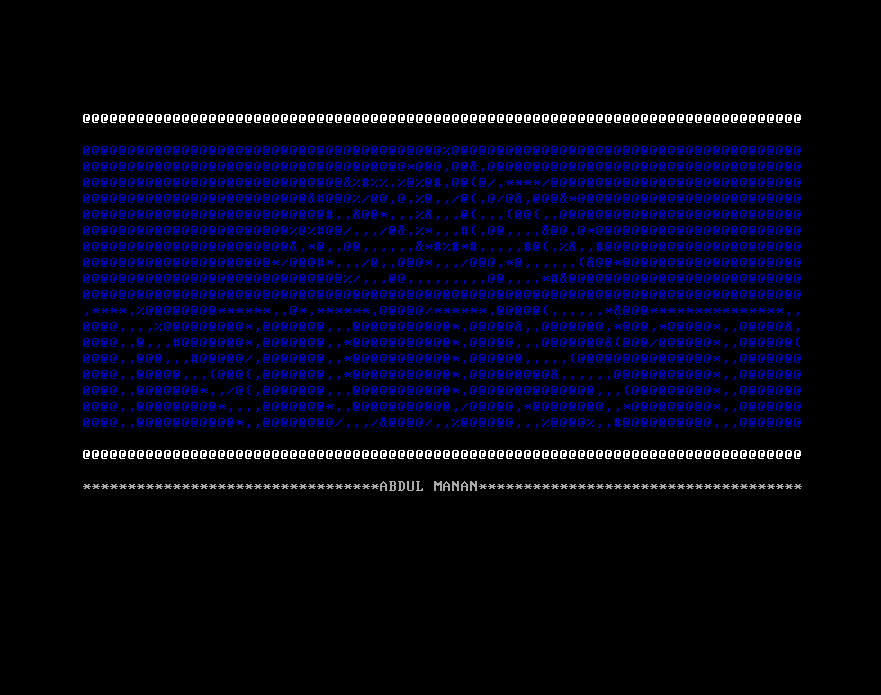

# Assignment - Creating an operating system
This is the project that was assigned in Computer Assembly and Organization course in which we have to build a basic 64-bit operating system.

The working of the project is explained here [https://abdulmanann.github.io/project/operation-system/](https://abdulmanann.github.io/project/operation-system/)

Required output: 

